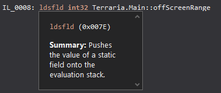

# IL Editing
IL Editing is the process of editing method's CIL with MonoMod using `ILHook`s, this allows for finer more granular control than standard `Hook`s (commonly referred to as detours) provide.

tModLoader provides generated events for hooking vanilla methods (usually `On`/`IL_TypeName.MethodName`.)
If a method is not provided by these events you should use `MonoModHooks.Add`/`Modify`to apply hooks, (`Add` being for detours whilst `Modify` being for IL edits.)\
Hooks applied in the manner listed above do NOT have to be unloaded manually.

## Prerequisites
- [ILSpy](https://github.com/icsharpcode/ilspy) - Allows for browsing of disassembly, with options to show C# lines above their respective instructions.
- Familiarity with tModLoader and Terraria's codebase.

## Concepts
### Instructions/Opcodes
An Operation Code (Opcode) also called an instruction, specifies what operation to preform.\
It is vital that you understand what each Opcode does when writing edits, ILSpy gives a tooltip when hovering an instruction and will open documentation when clicked.\


### The Stack
The stack is a collection of values that can be pushed to, or popped from; instructions may push values to and from the stack.\
TODO:
  - Better outline how this can be manipulated?

### ILCursor
The `ILCursor` type is the standard way of manipulating `ILContext`, can be initialized directly from the `ILContext` instance provided in edits.
`ILCursor` provides various methods for navigating the context, namely (`Try`)`GotoNext`/`Prev`and `FindNext`/`Prev`, these methods should always be used instead of manually setting `ILCursor.Index`.

Use `ILCursor.Emit` or `ILCursor.Emit[X]` (With `[X]` as the name of the Opcode) to insert an instruction at the index of the cursor, this will move the cursor after the emitted instruction as well.
`ILCursor.EmitDelegate` will emit a call to the passed delegate, useful for having relevant code be in-line with the surrounding edit.

`ILCursor.Remove`(`Range`) removes the next instruction(s), should NOT be used for compatibility with other mods, (although context dependant.)

### Targets/Labels
A target/label points to a specific instruction in the context, used by Branching opcodes to move to the target.\
`ILLabel`s can be obtained from the context by outing them from match predicates in navigation methods, or created with `ILCursor.DefineLabel`.
```cs
ILLabel? jumpCheckTarget = null;

c.GotoNext(
    i => i.MatchBneUn(out jumpCheckTarget)
);

if (jumpCheckTarget is null)
{
    return;
}
```

## Limitations
### In-lining
Certain methods, particularly smaller methods that are not decorated with `[MethodImpl(MethodImplOptions.NoInlining)]` may be inlined,
in which methods invoking the target method will replace the target method with its body directly, unapplying any hooks.
This manifests seemingly randomly and can differ from session to session.

This however can be rectified by applying a blank edit to all methods that use the target method (found easily by using ILSpy's analyze feature) after applying hooks to the target method.
```cs
On_FilterManager.CanCapture += (_, _) => true;

// "Re-JITs" Main.DoDraw, causing the method to consider FilterManager.CanCapture with our hooks applied.
IL_Main.DoDraw += _ => { };
```
### Garbage Collection
TODO

## Best Practices
- It is preferred that edits are done in static methods.
- Edits should NOT be segregated to seperate types/files that handle specifically monomod behaviour if it can be helped.
- Edits should be written with other mods in mind, don't be entirely reliant on long sequences of predicates matching,
  and instructions should not be removed as other mods may rely on them for their own matching.
- Opt for handling large logic inside calls or delegates instead of emitting the entire method body manually.
- When emitting instructions pertaining to locals/arguments, you should prefer grabbing the index of the local/argument from the context similarly to labels.
  ```cs
  var elementIndex = -1;

  c.GotoNext(
      MoveType.After,
      i => i.MatchLdarg(out elementIndex),
      i => i.MatchLdarg(out _),
      i => i.MatchCall<UIElement>("DrawSelf")
  );
  ```

## Simple Example
- Outline a simple injection of custom logic into some method.

## Complex Example
- Outline injection of custom logic into some method that makes use of branching.

## Debugging
- Outline common errors and what causes them.
